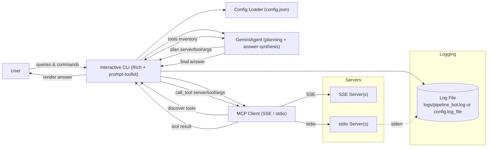

# Pipeline Toolkit

An interactive, Rich-powered CLI that connects to multiple MCP servers (SSE and stdio), plans tool calls using a Gemini AI agent, executes the chosen tool, and synthesizes helpful, structured answers.

## Features

- Multi-server MCP client (SSE and stdio transports)
- Automatic tool planning via Gemini (google-generativeai)
- Argument extraction from the user query (domain-agnostic: Testing Farm, Brew, Jira, Errata, etc.)
- Pretty CLI with history, auto-complete, spinners and tables
- Log file redirection (stdio stderr routed to file, truncated on restart)
- Built-in commands:
  - `list servers`, `list tools`
  - `show logs`
  - `clear`, `help`, `exit`/`quit`

## Project structure

```
repo/
  ├─ config/
  │   ├─ config.json             # your active configuration
  │   └─ config.json.example     # example configuration (copy to config.json)
  ├─ logs/
  │   └─ pipeline_bot.log        # log file (truncated on each start)
  ├─ src/
  │   ├─ ai_agent.py             # Gemini agent (planning + answer synthesis)
  │   ├─ cli.py                  # Interactive CLI (entry module for scripts)
  │   ├─ config.py               # Config loader & validation
  │   └─ mcp_client.py           # MCP client for SSE & stdio
  ├─ pyproject.toml              # packaging and entry points
  └─ README.md
```

## Requirements

- Python 3.13+
- MCP Python client (`mcp`)
- Rich, prompt-toolkit
- Google Generative AI (`google-generativeai`) for the Gemini agent

## Installation

Install in editable mode:

```bash
pip install -e .
# or with uv
uv pip install -e .
```

This installs the CLI commands:

- `pipeline-toolkit`
- `ptk`

## Environment Variables

Set up the required environment variables:

```bash
# Required for Gemini AI integration
export GEMINI_API_KEY="your-gemini-api-key-here"
```

You can also create a `.env` file in your project root or add these to your shell profile (`.bashrc`, `.zshrc`, etc.).

## Configuration

Create `config/config.json` (or copy from the example below). The config supports:

- `log_file` (optional): Absolute or `~` path to the log file. If not set, defaults to `logs/pipeline_bot.log`.
- `gemini` (optional): Model configuration for tool planning and answer generation. API key is read from `GEMINI_API_KEY` environment variable.
- `mcp_servers`: List of MCP server entries with either `sse` or `stdio` transport.

### Example: `config/config.json.example`

```json
{
  "log_file": "~/pipeline-toolkit.log",
  "gemini": {
    "_comment": "API key is read from GEMINI_API_KEY environment variable",
    "model": "gemini-2.0-flash-exp"
  },
  "mcp_servers": [
    {
      "name": "Testing Farm MCP Server",
      "connection_type": "sse",
      "url": "http://localhost:8000",
      "enabled": true,
      "description": "SSE-based Testing Farm MCP server"
    },
    {
      "name": "Errata MCP Server",
      "connection_type": "stdio",
      "command": "podman",
      "args": [
        "run",
        "-i",
        "--rm",
        "-e",
        "MCP_TRANSPORT=stdio",
        "localhost/errata-mcp:latest"
      ],
      "working_directory": "/abs/path/to/errata-mcp",
      "enabled": false,
      "description": "Errata operations MCP server"
    },
    {
      "name": "Jira MCP Server",
      "connection_type": "stdio",
      "command": "podman",
      "args": [
        "run",
        "-i",
        "--rm",
        "--env-file",
        "~/.jira-mcp.env",
        "localhost/jira-mcp:latest"
      ],
      "enabled": false,
      "description": "Query Jira issues via MCP"
    },
    {
      "name": "Brew MCP Server",
      "connection_type": "stdio",
      "command": "python",
      "args": ["-m", "brew_mcp_server"],
      "enabled": false,
      "description": "Query Brew tags/builds"
    }
  ]
}
```

Notes:
- `~` and `$VARS` in `command`, `args`, and `working_directory` are expanded automatically.
- For containerized stdio servers, ensure images are available locally, and use absolute paths for `--env-file`.

## Usage

Start the CLI:

```bash
pipeline-toolkit
# or
ptk
```

Example queries:

- Information requests:
  - "List latest Errata products"
  - "Is build abc-1.2.3 in brew tag rhel-9.4.0-candidate?"
  - "Get the latest pipeline run for project X"

- Failure analysis:
  - "Analyze why job 123e4567-e89b-12d3-a456-426614174000 failed in testing-farm"
  - "Investigate Jenkins pipeline error from this log: <paste log>"

Built-in commands:

- `list servers` – show connected MCP servers
- `list tools` – show tools discovered from servers
- `show logs` – display the current log file in the console
- `clear`, `help`, `exit`/`quit`

While processing, the CLI shows the chosen server/tool (when planned by the agent):

```
Calling tool: <Server Name> :: <tool_name>
```

## Logging

- The log file is truncated on each start.
- Default path: `logs/pipeline_bot.log` (created automatically). Override with:
  - `log_file` in `config.json`, or
  - `PIPELINE_TOOLKIT_LOG_DIR` environment variable (directory containing the default file name).
- Stdio server stderr is redirected to the log file, not to the terminal.

## Troubleshooting

- "No module named 'src'": ensure editable install (`pip install -e .`). Entry points expect modules to be discovered under `src/` via `tool.setuptools.package-dir`.
- Stdio server does not start:
  - Verify `command` exists and images are available (`podman run ...`).
  - Use absolute paths for `--env-file` and `working_directory`.
  - Check `logs/pipeline_bot.log` for errors.
- Agent not planning tools:
  - Ensure `GEMINI_API_KEY` environment variable is set.
  - Verify servers expose tools (via `list tools`).

## Development

Reinstall after changes:

```bash
pip install -e .
```

Build (uv):

```bash
uv build
```

## Architecture



- The CLI loads configuration, connects to MCP servers, lists tools, and orchestrates calls.
- The Gemini agent plans which tool to call and generates the final answer from tool output.
- stdio server stderr is redirected to the log file; logs are truncated on each start.